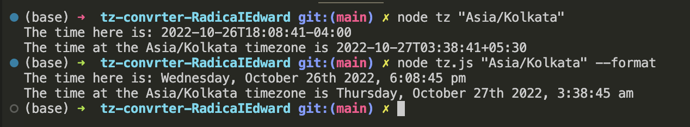

# ESLint Configuration

Functionality:
This is a time zone converter app for Eastern Standard Time.

Instructions:
1. Open Terminal
2. Enter "node tz.js <Country/City_Name> for the country you wish to conver the timezone to.
3. To format the output in a more readable format, include the --format tag

Example:
